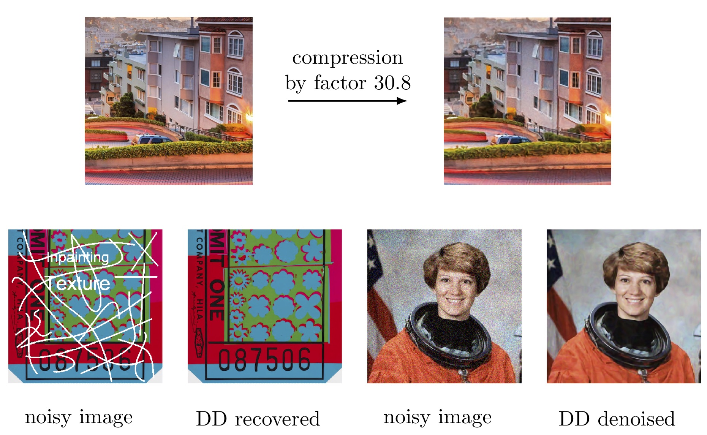

# Deep Decoder

This repository provides code for reproducing the figures in the  paper:

**``Deep Decoder: Concise Image Representations from Untrained Non-convolutional Networks''**, by Reinhard Heckel and Paul Hand. Contact: rh43@rice.edu

The paper is available online [[here]](http://www.reinhardheckel.com/papers/deep_decoder.pdf).

The deep decoder is a simple image generating deep neural network. The network is untrained, non-convolutional, and under-parameterized, i.e., it generates images from few paramters. The deep decoder enables image compression and solving invere problems:




## Installation

The code is written in python and relies on pytorch. The following libraries are required: 
- python 3
- pytorch
- numpy
- skimage
- matplotlib
- scikit-image
- jupyter

The libraries can be installed via:
```
conda install jupyter
```


## Citation
```
@article{heckel_deep_2018,
    author    = {Reinhard Heckel and Paul Hand},
    title     = {Deep Decoder: Concise Image Representations from Untrained Non-convolutional Networks},
    journal   = {International Conference on Learning Representations},
    year      = {2019}
}
```

## Licence

All files are provided under the terms of the Apache License, Version 2.0.
